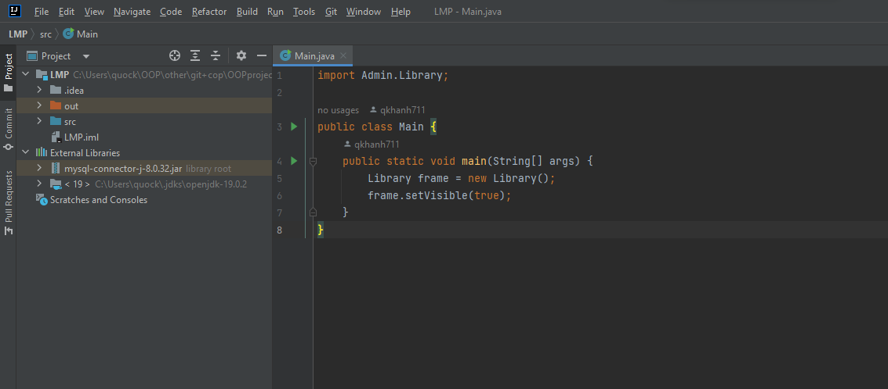

# 📚 OOP project -Java

Source Code Bài tâp lớn OOP về quản lí thư viện trường đại học Phenikaa

Sử dụng: 

         - Java swing (Graphical User Interface) -> tạo giao diện người dùng 
         - Java AWT (Abstract Window Toolkit) -> tạo các giao diện đồ họa

Nhóm 8: 

         | Nguyễn Quốc Khánh| Nguyễn Thị Hà | Trần Long Hải|
         |     21011495     |   21010988    |     2101     |  
         |     K15-KHMT     |  K15-CNTT-VJ1 |   K15-CNTT1  |

Hướng dẫn chạy code:

Clone code từ git

         git clone https://github.com/qkhanh711/OOPproject.git

sau khi clone có folder:

        OOPproject/
            LMP/
                idea/
                out/
                src/
            LibraryJTP/

## How to Run

B1: Cài IDE Intelij tại link

         https://www.jetbrains.com/idea/download/#section=windows 

B3: Đăng ký tài khoản jetbrain để sử dụng IDE, sau khi mở Intelij chọn Open -> LMP -> OK kết quả như hình dưới

**Step 1:**

